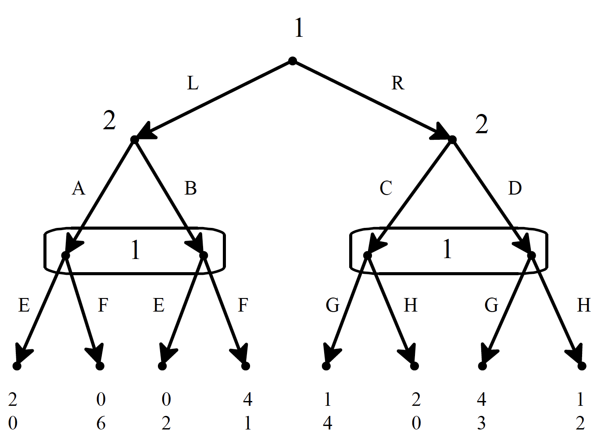

# Subgame and Nash Equilibrium

Consider this game, from Bonnano.

{width=50%}

You are asked to answer three questions about it:

(a) Write the corresponding strategic-form game.
(b) Find all the pure-strategy Nash equilibria.
(c) Find the mixed-strategy subgame-perfect equilibrium.

To work out the strategic form, we need to work out everyone's strategies. Player 1 has three information sets that she plays at - the top, the bottom left and the bottom-right. And she has two choices at each of these, so she has $2 \times 2 \times 2 = 8$ strategies. Player 2 has two information sets that she plays at, and two choices at each, so she has four strategies. Helpfully, the choices are given different names, so a string of letters unambiguously names a strategy. Then it is just a matter of reading off the table to get the payoff table. I'll put Player 1 on the row, because it is better to have more rows than columns.

|      |  AC  |  AD  |  BC  |  BD  |
|:----:|:----:|:----:|:----:|:----:|
| LEG  | 2,0  | 2,0  | 0,2  | 0,2  |
| LEH  | 2,0  | 2,0  | 0,2  | 0,2  |
| LFG  | 0,6  | 0,6  | 4,1  | 4,1  |
| LFH  | 0,6  | 0,6  | 4,1  | 4,1  |
| REG  | 1,4  | 4,3  | 1,4  | 4,3  |
| REH  | 2,0  | 1,2  | 2,0  | 1,2  |
| RFG  | 1,4  | 4,3  | 1,4  | 4,3  |
| RFH  | 2,0  | 1,2  | 2,0  | 1,2  |

Now we try to find Nash equilibria by finding best responses. I've bolded them in this version of the table.

|      |  AC  |  AD  |  BC  |  BD  |
|:----:|:----:|:----:|:----:|:----:|
| LEG  | **2**,0  | 2,0  | 0,**2**  | 0,**2**  |
| LEH  | **2**,0  | 2,0  | 0,**2**  | 0,**2**  |
| LFG  | 0,**6**  | 0,**6**  | **4**,1  | **4**,1  |
| LFH  | 0,**6**  | 0,**6**  | **4**,1  | **4**,1  |
| REG  | 1,**4**  | **4**,3  | 1,**4**  | **4**,3  |
| REH  | **2**,0  | 1,**2**  | 2,0  | 1,**2**  |
| RFG  | 1,**4**  | **4**,3  | 1,**4**  | **4**,3  |
| RFH  | **2**,0  | 1,**2**  | 2,0  | 1,**2**  |

And you can see that no cell has two bolded numbers. So there is no pure-strategy Nash equilibrium.

To find the subgame perfect equilibria, note that the game really boils down to this game. Player one chooses whether to play this game

|   |  A  |  B  |
|--:|:---:|:---:|
| E | 2,0 | 0,2 |
| F | 0,6 | 4,1 |

Or this game

|   |  C  |  D  |
|--:|:---:|:---:|
| G | 1,4 | 4,3 |
| H | 2,0 | 1,2 |

Neither game has a pure-strategy Nash equilibrium, so we apply the formula for finding the equilibrium for finding mixed strategy equilibria. That gives us for the first game

$$
\Pr(A) = \nicefrac{2}{3}; \Pr(B) = \nicefrac{1}{3}
$$
$$
\Pr(E) = \nicefrac{5}{7}; \Pr(F) = \nicefrac{2}{7}
$$
$$
V(E) = V(F) = \nicefrac{4}{3}
$$

And for the second game

$$
\Pr(C) = \nicefrac{3}{4}; \Pr(D) = \nicefrac{1}{4}
$$
$$
\Pr(G) = \nicefrac{2}{3}; \Pr(H) = \nicefrac{1}{3}
$$
$$
V(G) = V(H) = \nicefrac{7}{4}
$$

So player 1, who gets to choose, plays R, then mixes G and H with probabilities $\nicefrac{2}{3}$, while player 2 plays C and D with probabilities $\nicefrac{3}{4}$ and $\nicefrac{1}{4}$ respectively. And they are disposed to use the probabilities above for A, B, E and F should player 1 play L.

Now imagine a variant on the game. Imagine the payoffs for L-B-F is 4,7 rather than 4,1. What change does this make to the game? First, let's do the table. I'll just do one table rather than doing one then bolding it.

|      |  AC  |  AD  |  BC  |  BD  |
|:----:|:----:|:----:|:----:|:----:|
| LEG  | **2**,0  | 2,0  | 0,**2**  | 0,**2**  |
| LEH  | **2**,0  | 2,0  | 0,**2**  | 0,**2**  |
| LFG  | 0,6  | 0,6  | **4**,**7**  | **4**,**7**  |
| LFH  | 0,6  | 0,6  | **4**,**7**  | **4**,**7**  |
| REG  | 1,**4**  | **4**,3  | 1,**4**  | **4**,3  |
| REH  | **2**,0  | 1,**2**  | 2,0  | 1,**2**  |
| RFG  | 1,**4**  | **4**,3  | 1,**4**  | **4**,3  |
| RFH  | **2**,0  | 1,**2**  | 2,0  | 1,**2**  |

Now there are four pure-strategy Nash equilibria. But how many of them are subgame perfect? Actually, the answer turns out to be none. The right-hand game is unchanged, so the mixed strategy equilibrium is the only equilibrium here. But drawing out the left-hand game reveals that it has a (unique) pure-strategy Nash equilibrium at BF.

|   |  A  |  B  |
|--:|:---:|:---:|
| E | 2,0 | 0,2 |
| F | 0,6 | 4,7 |

And now player 1 would get 4 from playing L, so she would prefer that. The only sub-game perfect equilibrium is that player 1 plays LF, player 2 plays B. But if player 1 had played R, they would have reverted to the mixed strategy equilibrium.

# Extensions of Subgame Perfection

Consider again the game from Selten's chain store paradox. The rules are

- First player 2 chooses E for enter or L for leave.
- Then if player 2 chooses E, player 1 chooses C for compete or N for normal.

The payoff structure is

- If L, the payoffs are 5, 1
- If CE, the payoffs are 0, 0
- If NE, the payoffs are 2, 2

And the theoretical point is that the pair E-L is Nash equilibrium, but not subgame perfect. So far so good. Change the game so that player 2 has three options. If they enter, they can choose to have either Red uniforms or Green uniforms. This doesn't affect anyone's payoffs, but player 1 doesn't find out which they chose until after they decide E or N. Intuitively, this shouldn't change the game, but now the pair E-L is subgame perfect. (Exercise: why is this?)

So there are a bunch of ideas about how to handle cases like this. The rough idea is that the following things are all true in equilibrium.

- At each information set, each player has a plan for what they will believe about the other players if that set is reached, and (if it is their information set) a plan about what to do should they get there.
- The plan about what to do will maximise expected utility given their planned beliefs.
- The plan about what to do could be probabilistic - it could be a mixed strategy.
- In equilibrium, everyone's (planned) beliefs mesh with everyone else's (planned) actions. So if I plan to play A with probability 0.8 and B with probability 0.2 at an information set, at that set you belief I'll play A with probability 0.8 and B with probability 0.2.
- Everyone's beliefs update in a sensible way. At the very least, if something happens that you gave non-zero probability to, then you update by conditionalisation. And if something happens that you gave zero probability to, then you still believe that everyone has beliefs (or probabilities), that they act in ways as to maximise utility given their beliefs, that they believe this about everyone else, and so on.

That's enough to solve the red uniform/green uniform problem. There is no way for player 1 to have any beliefs at all about what uniform player 2 has chosen so that C has a higher expected return than N.

But from here on it gets painful. The picture I've sketched so far turns out to allow equilibria that are not subgame perfect equilibria. So there becomes a game of finding extra restrictions on how beliefs can update on probability 0 events to rule that out. But the suggestions for how to do this are very hard to motivate. So let's stick with what I've said here, which is roughly weak sequential equilibrium.

# Evolutionary Stable Strategies

These only apply to symmetric games. Let's say $u(x, y)$ is the utility a player gets from playing $x$ when the other player does $y$. A strategy $a$ is an evolutionarily stable strategy if for any other strategy $b$, either

- $u(a, a) > u(b, a)$ or
- $u(a, a) = u(b, a)$ and $u(a, b) > u(b, b)$

Intuitively, if everyone is playing $a$, then either playing $b$ will do worse, or playing $b$ will do no better, but then will do worse if you start running into other $b$-players.

One upside of these is that they have a reasonable dynamic alternative. If you imagine a repeated game between strategies, with the population at time $t+1$ proportional to how well that strategy does at time $t$, the game tends to some ESS or other.

One related downside is that some ESSs have a very small **basin of attraction** - the world has to be just right to end up with them as the resulting state.

\newpage

# Signalling Games

Here is the basic idea of a signalling game.

- There are two players, a sender and a receiver.
- Nature reveals some information to sender. (Or, if you want to make the game symmetric, nature chooses one of the two players to reveal information to.)
- Sometimes (especially in econonomic applications) we'll call this sender's **type**.
- Sender sends a signal that receiver can see.
- Receiver chooses an action that has a payoff to each player.

We'll start by considering **cooperative** signalling games. These are games where the players get the same payoff in every situation. Intuitively, they are ones where the players want to share information because they are in a joint venture.

To use a famous example, consider Robert Newman, the sexton of the Old North Church in Boston during the Revolutionary War. Part of his job (as a revolutionary) was to keep watch for what the Regulars were doing, and put signals in the window of the church to signal what they were doing. As the poem says, the signal was "One if by land, two if by sea". That is, he'd put out one lamp if they were coming by land, two if they were coming by sea. (Actually water; actually the Charles river. But that's not as poetic.) The other revolutionaries would then take suitable action.

So here Newman is the sender. Nature (well actually the British army) has revealed some information to him. (Inadvertently in this case.) Other people don't know this information. But they do know the signal he sends; they can see the number of lamps in the window. And they have a plan for what to do with each thing they see.

Now in reality, the plan they have is a good one. That's because they have coordinated in advance on what to do. But what if they can't coordinate. The game in this loose form has any number of Nash equilibria.

- It has **separating equilibria** where the townsfolk take different actions on seeing the different signals, and things work well for hearers and sender.
- It has **pooling equilibria** where Newman puts up the same signal come what may, and the townsfolk do the same thing no matter what he does.
- And it has **babbling equilibia** where Newman chooses randomly what to do, and the townsfolk ignore him.

But only the separating equilibria are ESS. There are two of these - we could have had one if by sea, two if by land. But apart from these two Nash equilibria, the other Nash equilibria are not evolutionarily stable.

This matters for two big debates

1. What is the relationship between human language and convention?
2. How do signalling systems evolve in non-human animals without agreement, or in most cases the capacity to do anything like make an agreement, as to what the signals will mean?

These are variants of the same question. How do you ever get a signalling system started? The answer being implicitly suggested here is that you randomly try a bunch of different strategies for navigating the world, keep the ones that work and not the ones that don't work (either intentionally or through natural selection), and eventually you'll end up signalling. We'll say much more about this over next week.

