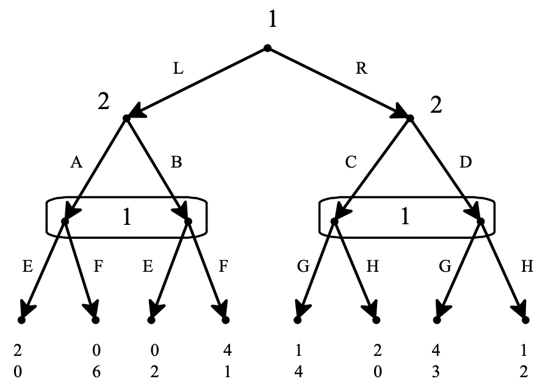

\pagenumbering{gobble}

You have a choice of assignments this week. You can either answer some numerical questions from chapter 7 of Bonanno, or do a (very) short essay. **Do not do both!**. You **either** do the 12 questions from the numerical track, **or** the essay question.

# Numerical Track

These questions all concern variants of the game tree on page 246 of Bonanno. It's the game tree for question 7.7, and the basic case is repeated here. (Looking over the answers to question 7.7 may be very helpful in working out these problems.)

{width=75%}

## Questions 1-4

Change the payoffs of the game to replace every value of 4 with -4. So if player 1 plays L, then player 2 plays B, then player 1 plays F, the outcome is no longer 4, 1; it's -4, 1.

1. How many pure-strategy Nash equilibria are there in this variant of the game?
2. In the (possibly mixed) subgame-perfect equilibrium of this variant of the game, does 1 play L or R?
3. In the (possibly mixed) subgame-perfect equilibrium of this variant of the game, what is player 1's expected return?
4. In the (possibly mixed) subgame-perfect equilibrium of this variant of the game, what is player 2's expected return?

## Questions 5-8

Change the payoffs of the game to replace every value of 4 with 3. So if player 1 plays L, then player 2 plays B, then player 1 plays F, the outcome is no longer 4, 1; it's 3, 1.

5. How many pure-strategy Nash equilibria are there in this variant of the game?
6. In the (possibly mixed) subgame-perfect equilibrium of this variant of the game, does 1 play L or R?
7. In the (possibly mixed) subgame-perfect equilibrium of this variant of the game, what is player 1's expected return?
8. In the (possibly mixed) subgame-perfect equilibrium of this variant of the game, what is player 2's expected return?

## Questions 9-12

Change the payoffs of the game by switching what player 1 and player 2 get in each outcome. So if player 1 plays L, then player 2 plays B, then player 1 plays F, the outcome is no longer 4, 1; it's 1, 4.

9. How many pure-strategy Nash equilibria are there in this variant of the game.
10. In the (possibly mixed) subgame-perfect equilibrium of this variant of the game, does 1 play L or R?
11. In the (possibly mixed) subgame-perfect equilibrium of this variant of the game, what is player 1's expected return?
12. In the (possibly mixed) subgame-perfect equilibrium of this variant of the game, what is player 2's expected return?

# Essay Track

Write 600-800 words (no more), on the following questions.

Very briefly describe the Spence signalling model of why people go into higher education, and why employers pay a premium for college graduates. As an explanation of the wage premium that college graduates receive, what about it is most plausible? And what about it is least plausible? (In the space you've got, you won't really be able to _defend_ these claims about plausibility - I just want you to identify a strength and a weakness of the model.)